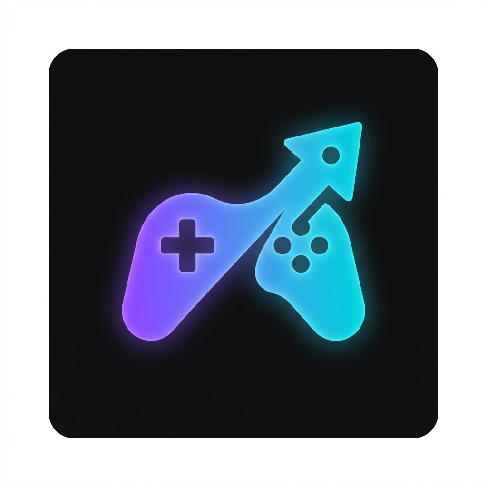

# LFGL - Luty Friendly Game Launcher

A modern, lightweight game launcher with a premium glass UI aesthetic.



## Features

- 🎮 **Steam Integration** - Auto-detects Steam games with high-quality artwork
- ➕ **Manual Game Add** - Add any game or application manually
- 📁 **Smart Scanning** - Detects games from desktop shortcuts, AppData, and registry
- 🗂️ **Categories** - Organize games into All, Favorites, Steam, Manual
- ⚙️ **Settings** - Start on startup, auto-scan, close to tray
- 💾 **Persistence** - Remembers your library across restarts
- 🌟 **Welcome Animation** - Personalized greeting with your Steam username

## Tech Stack

- **Framework**: .NET 10 + WinUI 3 (Windows App SDK 1.6)
- **Language**: C# 14
- **UI**: Mica backdrop, Acrylic brushes, smooth animations

## Building

```powershell
# Debug build
dotnet build

# Release build
dotnet publish -c Release -r win-x64 --self-contained
```

## Creating Installer

1. Install [Inno Setup](https://jrsoftware.org/isinfo.php)
2. Build the release version (see above)
3. Open `Installer/LFGL.iss` in Inno Setup Compiler
4. Click Build → Compile

The installer will be created in the `Installer/Output` folder.

## Project Structure

```
LFGL/
├── Assets/              # Icons and images
├── Dialogs/             # ContentDialog components
├── Features/
│   ├── Library/         # Game persistence
│   ├── Scanning/        # Game detection logic
│   └── Settings/        # App configuration
├── Pages/               # Settings page
├── Installer/           # Inno Setup script
└── MainWindow.xaml      # Main UI
```

## License

MIT
